# Inventory Management Agent

A small multi-agent LangGraph app for inventory management — look up/create/update items,
move stock between warehouses, and cut/receive purchase orders with vendors, all through a
chat interface.

Heads up: this is a demo, not something we run in production. It's here to show a
particular way of building multi-agent systems — fixed routing instead of a free-roaming
agent loop, different models for different jobs, summarizing context instead of just
truncating it, and a real (if minimal) AWS deployment. See the bottom of this doc for what's
deliberately left out.

## Architecture



There's a planner, three specialist agents, and a summarizer, wired up as a LangGraph graph:

```
START ──┬──> planner ──(picks exactly one)──> inv_mgmt_agent      ──┐
        │                                 ──> item_transfer_agent ──┼──> summarizer ──> END
        │                                 ──> vendor_agent        ──┘
        └──> compactor ──────────────────────────────────────────────────> END
```

The planner classifies what the user wants and routes to exactly one of the three
specialists — it doesn't decide anything else, and nothing loops back to it. That's the
"deterministic workflow" part: the set of paths through the graph is small and fixed, so
you can reason about what a given request will do before you run it, instead of hoping the
agent converges on the right sequence of steps on its own.

- `inv_mgmt_agent` handles item CRUD, `item_transfer_agent` moves stock between warehouses,
  `vendor_agent` handles purchase orders. Each is a tool-calling sub-agent scoped to just
  that job, and each hands back a typed (Pydantic) result rather than a paragraph of text.
- `summarizer` turns that typed result into the message the user actually sees.
- `compactor` runs alongside the planner on every turn — it's not part of the main
  request/response path, it just keeps conversation state from growing forever (more on
  this below).

## It's a synchronous call, start to finish

There's no streaming and no background jobs. A request comes in with a `session_id` and a
message, `agent.invoke(...)` runs the whole graph, and one response goes back — that's it.
Locally that's a FastAPI endpoint (`api/main.py`); on AWS it's a Lambda behind API Gateway
using buffered invocation (`agent/lambda.py`). Simple to reason about, at the cost of
latency — if a request goes through the planner, a tool-calling agent, and the summarizer,
you're waiting on all of those model calls in sequence before anything comes back.

Nothing about the graph forces this, though. Async HTTP (return immediately, let the client
poll or hit a webhook) or streaming the response back over SSE as each node finishes would
both work here too — we just went with the simplest option for a demo.

## Different models for different nodes

Not every node needs the same amount of brains. The planner and the three specialist agents
make decisions that touch real data — routing, creating/updating/deleting items, moving
stock, cutting POs — so they run on `claude-sonnet-4-5`. A weaker model, in testing, would
occasionally skip a tool call it should have made or guess at an argument the user never
gave it, which is exactly what you don't want when the tool call writes to a database.

`compactor` and `summarizer`, on the other hand, are just rewriting text that's already been
fetched — no decisions, no tools. Those run on `claude-haiku-4-5`, which is cheaper and
faster and plenty good enough for that job.

Worth doing in most multi-agent systems, honestly, not just this one: figure out which
nodes can break something if the model gets it wrong, and spend the model budget there.

## Keeping context under control

`compactor` runs on every turn in parallel with the planner. It trims the message history
down to a token budget, and — only when something actually got trimmed — folds whatever was
dropped into a running `conversation_summary` on the graph state, extending the previous
summary rather than starting over. Every node that talks to a model (planner, the three
specialists, the summarizer) gets that summary prepended ahead of the live messages. So the
prompt stays bounded on a long conversation, but earlier context isn't just thrown away.

## Bedrock

Every model call goes through AWS Bedrock via `langchain_aws.ChatBedrockConverse`, running
in `us-east-2`. No OpenAI or direct Anthropic API key anywhere — the Lambda's IAM role is
just granted `bedrock:InvokeModel` / `bedrock:InvokeModelWithResponseStream`
(`terraform/iam.tf`), and that's the only credential the agent needs.

## Tracing, if you want it

LangSmith tracing needed zero changes to the agent code. LangChain/LangGraph already check
for `LANGSMITH_TRACING`, `LANGSMITH_API_KEY`, and `LANGSMITH_PROJECT` in the environment and
instrument every node, model call, and tool call automatically when they're set. Leave the
API key unset and nothing changes; set it and every planner decision and tool call for a
request shows up as a trace.

## Running on AWS

Terraform (`terraform/`) provisions the whole thing:

- The agent is a Lambda (`agent/lambda.py`) behind an API Gateway HTTP API. It seeds its
  own SQLite database into `/tmp` on cold start — there's no RDS or anything managed.
- The UI (`agent-ui/`) is a small React app, built and synced to an S3 bucket set up for
  static website hosting.
- Two GitHub Actions workflows deploy the agent and the UI independently, each path-filtered
  so a change to one doesn't redeploy the other.

## What's missing, on purpose

- Inventory data lives in SQLite in `/tmp` and gets reseeded from scratch on every Lambda
  cold start — changes don't persist, and don't share across concurrent instances.
- Conversation history is kept with an in-memory LangGraph checkpointer, so it has the same
  problem: gone on cold start, not shared across instances.
- The S3 site is plain HTTP — no CloudFront, no TLS, no custom domain.
- The API and the UI are both public with no auth and no rate limiting.
- No automated tests — correctness so far has been checked by hand, running real multi-turn
  conversations against a scratch copy of the database.

All fixable, just not the point of this project.

---

**Need this reliable in production, not just as a demo?** [Arul Systems](https://www.arulsystems.com/)
helps customers build reliable agents quickly, at scale. [Get in touch](https://www.arulsystems.com/contact).
